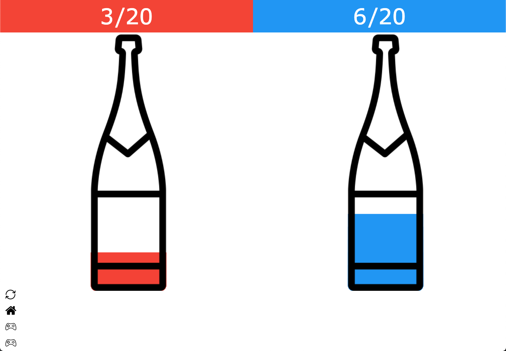
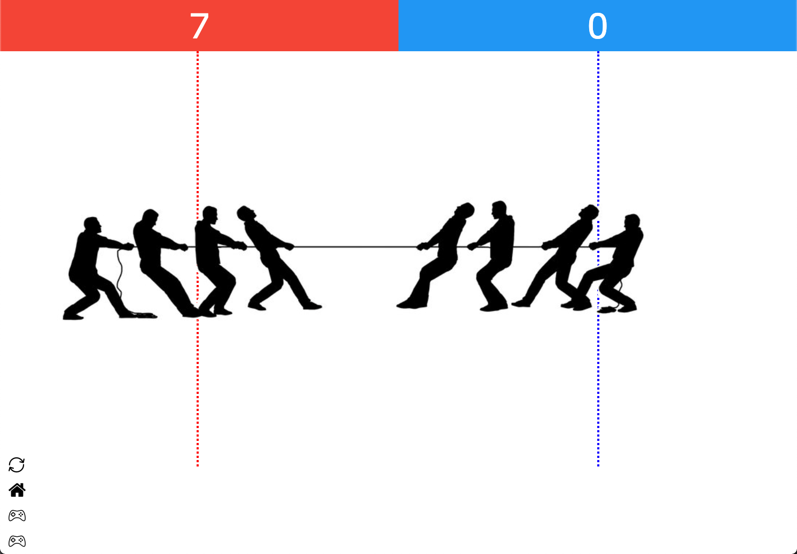
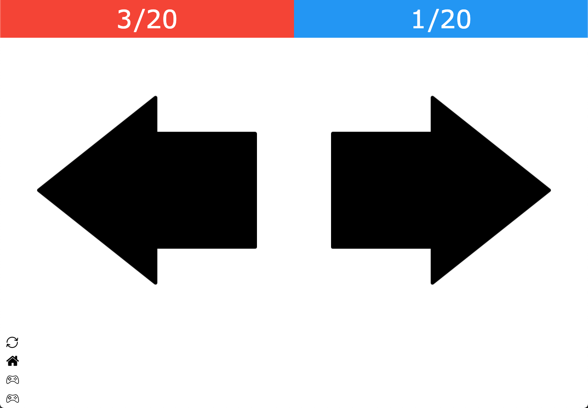
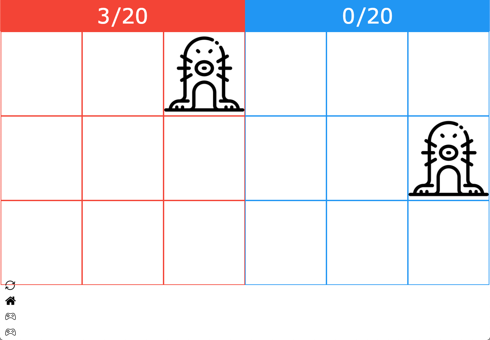

### Description

A basic Javascript game engine for 2 players or more. The idea is to use the phone as the game controller and use a dedicated computer screen to display the game canvas.

### Technology Stack
- Language: [Vanilla Javascript](http://vanilla-js.com)
- Frontend: HTML & [EJS](https://ejs.co)
- Backend: [Express](https://expressjs.com) & [Server-sent events](https://developer.mozilla.org/en-US/docs/Web/API/Server-sent_events/Using_server-sent_events)

### Screenshots

